# Homework 1

<b>宋林恺 PB21051079</b>

<b>罗胤玻 PB21111627</b>

## T1

##### 风险:
- 1.该算法可能存在后面以及漏洞，美国政府可能可以通过该漏洞encrypt发送的密文
- 2.算法过于单一，若该算法存在vulnerability那么大量用该算法加密的用户将收到威胁
- 3.缺乏可信度，其余国家的政府，机构以及个人可能不回使用该算法
##### 怎样避免：
- 1.使用收到广泛接受的开源算法。
- 2.自己开发一种加密算法，不依赖美国政府的加密算法。
- 3.设计时使用多种加密手段避免单一加密算法导致的问题。
- 4.成立中立机构指定加密标准
----

## T2

##### block cipher的意义
- 1.不可以加密任意长度的数据，然而很多场景下需要加密不定长或变长的数据如流数据的加密。
- 2.不满足IDB-security，对于同一个明文加密的密文是相同的容易被攻击。
以下表格为CBC和CTR的对比

|                        | CBC        | CTR      |
|------------------------|------------|----------|
| Sequential or Parallel | Sequential | Parallel |
| Error Propagation      | Yes        | No       |
| Can reuse IV/Nonce     | No         | No       |
| Padding                | Yes        | No       |
----

## T3 Hash Collision

- 哈希碰撞原因：输入空间大于输出空间，即不同的输入可能映射到相同的输出。
- 碰撞不是哈希函数的缺陷：哈希函数通常具有强抗碰撞性，攻击者如果不能在多项式时间内找到碰撞。

----

## T4  TLS Certificat

### ustc.edu.cn
**1. 证书日期及CA**
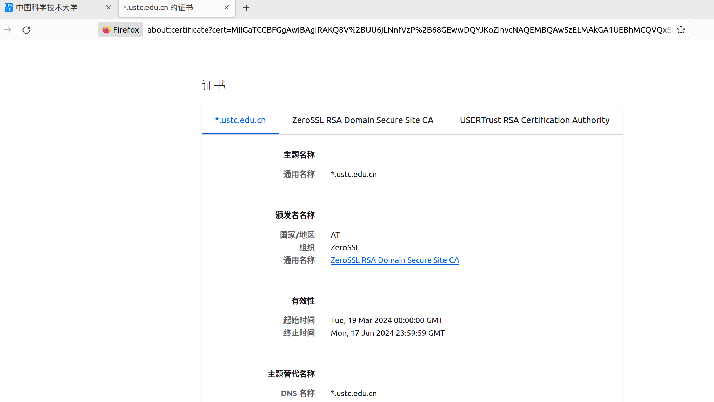

**2. 证书公钥**
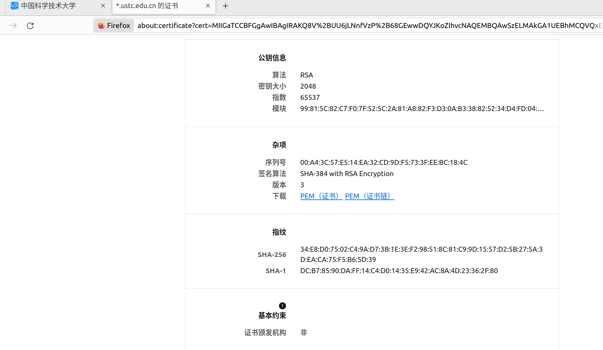

**3. pem文件计算**
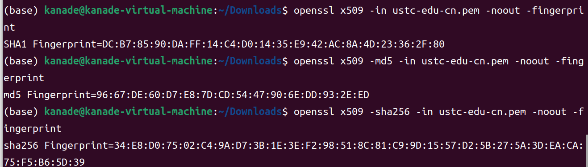

### 12306.cn
**1. 证书日期及CA**
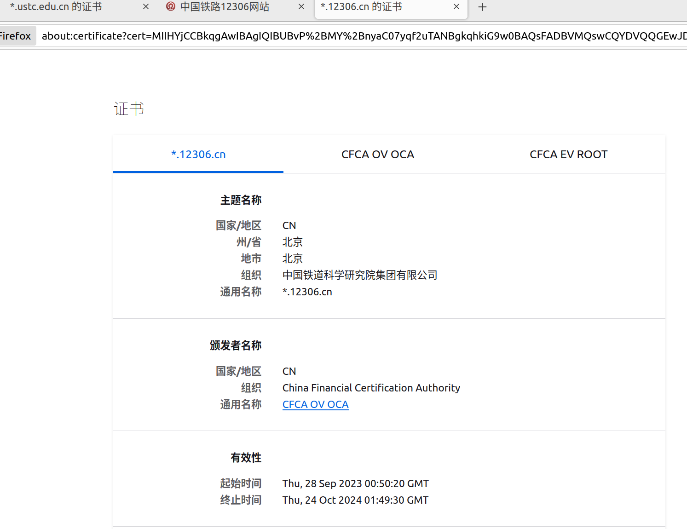

**2. 证书公钥**
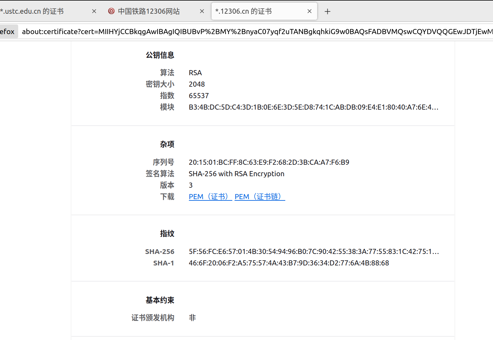

**3. pem文件计算**
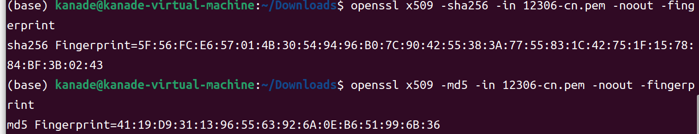

### www.bing.com
**1. 证书日期及CA**
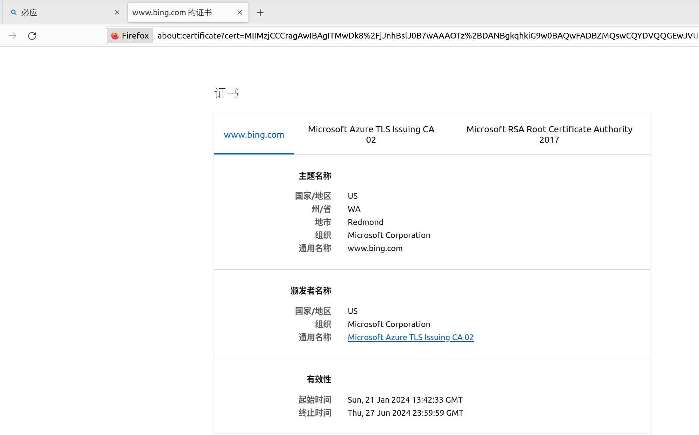

**2. 证书公钥**
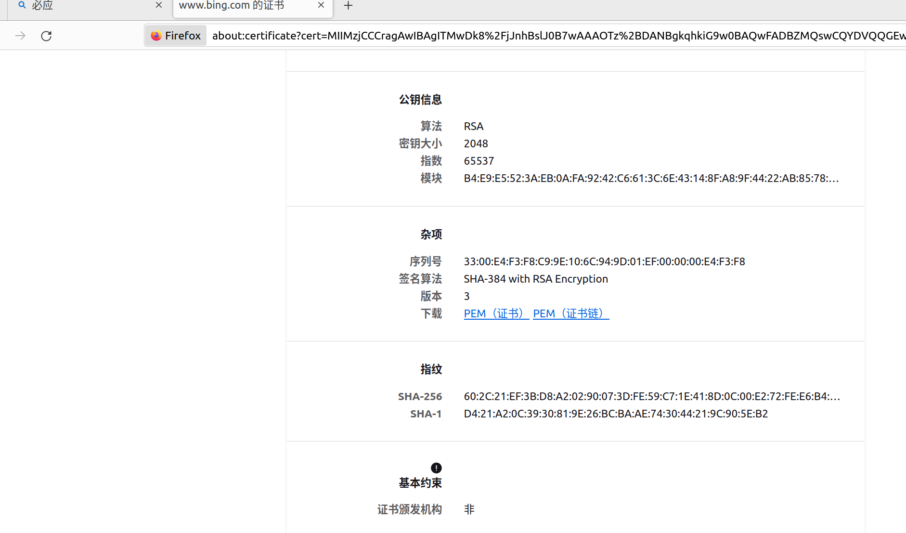

**3. pem文件计算**

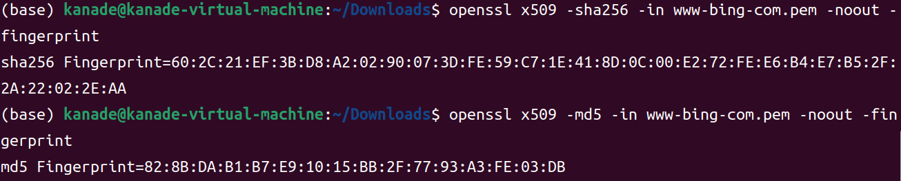

---

## T5  Encrypt/Decrypt/Sign through openssl

### (a)-(b)
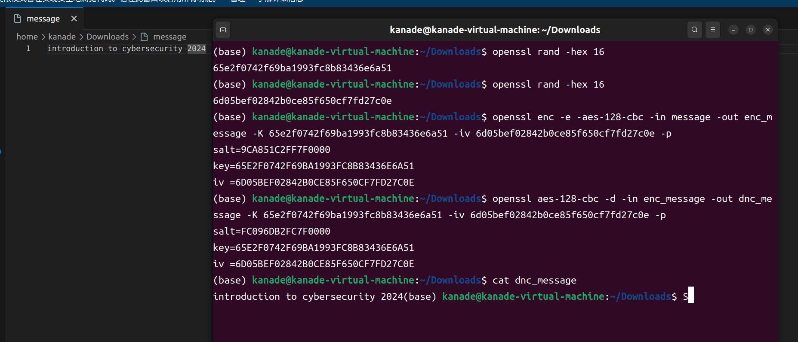
1. `openssl rand -hex 16` 生成128位密钥与随机向量
2. `openssl enc -e -aes-128-cbc -in message -out enc_message -K <key> -iv <initial vector>` 加密
3. `openssl enc -d -aes-128-cbc -in enc_message -out dec_message -K <key> -iv <initial vector>` 解密
**对比解密文件与原文件，无误。**

### (c)-（e）
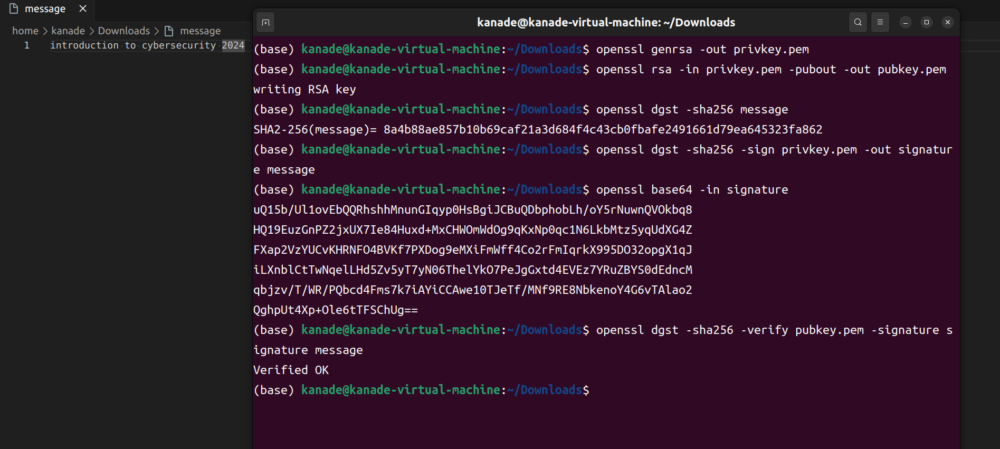
1. `openssl genrsa -out privkey.pem` 生成私钥
2. `openssl rsa -in privkey.pem -pubout -out pubkey.pem` 生成公钥
3. `openssl dgst -sha256 message` 计算消息SHA256 hash值
4. `openssl dgst -sha256 -sign privkey.pem -out signature message` 生成签名
5. `openssl base64 -in signature` 使用base64编码输出签名
6. `openssl dgst -sha256 -verify pubkey.pem -signature signature message` 验证签名

**最终结果：Verified OK**

---

## T6

----

## Contribution