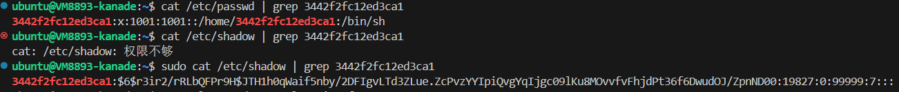

# Homework 2

<b>宋林恺 PB21051079</b>

<b>罗胤玻 PB21111627</b>

## T1

$$
t =\frac{95^{10}}{6.4\times 10^{6}} = 9.355\times10^{12}s = 2.967 \times 10^5 years
$$

------

## T2

### a

salt时一个随机数，在hash前与password链接。所以不同的密码即使相同，hash值也不同。这样即使两个用户有相同的密码，hash值也不同。这样使得攻击者难以使用rainbow table破解密码。

### b

增加salt的位数可以减少hash碰撞的概率这样攻击者需要更多次的尝试才能还原可能的plain text用于通过password验证，所以提高密码的安全性。

-------

## T3

### a

子进程继承父进程的user id 也为x。

### b

1.euid=y>0, suid=m, ruid=m, 此时没有root权限。 setuid(newuid) 的newuid是m (可以等于0)或y, 将euid设为newuid否则错误。

2.euid=0, suid=m, ruid=m, 此时有root权限。将euid, ruid, suid均设置为setuid(newuid)中newuid的值。

### c

1. 通过分配不同的uid，可以实现不同应用之间的隔离，避免应用之间的相互干扰。且防止一个应用窃取或破坏另一个应用的数据。
2. 通过分配不同的uid，可以实现不同应用之间的权限控制，避免应用之间的权限泄露。并且可以细粒度的控制应用的权限。
3. 通过分配不同的uid，可以实现不同应用之间的资源隔离，避免应用之间的资源争夺。且防止一个应用独占资源。

### d

1. 新进程的uid为root (0)，因为zygote进程是以root权限运行的新创建的进程将继承zygote的uid。
2. 重设uid是为了降低进程的权限，避免进程以root权限运行，提高系统的安全性。这样即使进程被攻击，或者该进程是恶意程序，也因权限较低仅有访问该进程资源的权限，而无法对系统进行破坏。

### e

1. passwd程序的setuid位应该设置为root，这样用户可以通过passwd程序修改自己的密码，因为密码只能被拥有root权限的程序修改程序权限为root则可以修改密码。
2. 因为passwd程序以root权限运行，对于系统资源的访问几乎不受限，防止被恶意程序compromise或者自身代码有错对系统破坏所以应该仔细编写。

-------

## T4

### a

首先恶意文件创建一个符号链接`file.data`但不指向任何文件该代码并不会return。在该代码休眠时，将符号链接指向如`/etc/passwd`非常重要且只能被拥有root权限更改的文件。那么该代码会将`Hello world`写入指向的文件，造成该文件被修改。

### b

并不能完全避免，因为用户程序并不能保证在`stat("f./ile.data", buf)`和`fopen("file.data)`之间恶意程序不能修改。因为1.用户程序的操作并不是原子的恶意程序仍然有时间改变符号链接。2.用户程序可能休眠，在此期间恶意程序有时间改变符号链接。

### c

在Linux中可以加入写保护，如可以在操作前将`file.data`所有者和组设为root，非所有者仅能rx不能w。这样恶意程序则不能在`stat("f./ile.data", buf)`和`fopen("file.data)`之间修改符号链接。完成操作后再重新设为可写。

------

## T5

### a

1. 优点： 通过提供更多的模式，可以更细粒度的控制进程的权限，提高系统的安全性。更好的控制进程对系统资源的访问，避免进程对系统资源的滥用。
2. 缺点：提供更多模式的安全会增加系统的复杂性，另外因为需要更频繁地切换privilege的模式，将会引入更多的开销（如上下文切换中时间的开销以及每种模式都需要有独立堆栈造成的内存开销），降低系统的性能。

### b
特权指令和 VAX/VMS 相似：

- Kernel: Executes the kernel of the VMS operating system, which includes mem-
ory management, process management
- IO: Executes I/O operations and interrupt handling, such as device drivers
- Executive: Executes many of the operating system service calls, including file and
record (disk and tape) management routines
- Supervisor: Executes other operating system services, such as responses to user
commands
- User: Executes user programs, plus utilities such as compilers, editors, linkers,
and debuggers

不过将IO以及interrupt分开，再kernel模块中仅保留操作系统最核心的内存管理和进程管理。其余如IO和中断处理单独分为IO模式。

-------

## T6 A lab to understand user/password management on Unix/Linux
### a

### b

### c
[参考文章](https://www.maoyingdong.com/linuxetcshadow-tjtzt/)
密码以`$id$salt$hashed`的形式存储在`/etc/shadow`文件中，其中`id`表示加密算法，`salt`是随机数，`hashed`是加密后的密码。

### d
使用openssl工具对密码进行加密，结果如下：

与b中图中的结果相同

### e
设置密码为`1234567890`，重做b、d,最终结果吻合。

------

## T7 The security architecture of the chromium browser

### Summary

1. **研究背景**
   1. 浏览器发展成为应用程序平台
   2. 大多数浏览器架构延用了Mosaic的整体化架构
      1. 从性能角度上，整体化架构存在耦合性强所导致的应用崩溃后用户体验受影响严重的问题
      2. 从安全角度上，整体化架构导致攻击者利用漏洞攻击成功后可以影响整个浏览器甚至直接获取用户权限影响客户机
   3. 已有许多模块化架构的浏览器，但其仍存在问题
      1. 牺牲了与现有网站的兼容性，在网站甚至单个页面之间提供架构隔离
      2. 浏览器的安全策略非常复杂，并对页面的效果造成影响
2. **本文贡献**：
   1. 设计并实现了模块化设计的浏览器 Chromium Browser 解决了兼容性、安全性等问题
   2. 对 Chromium Browser 做了测试，修复了大部分现有的浏览器的漏洞并具备极强的兼容性
3. **Threat Model**
   1. 攻击者能力
      1. 攻击者拥有可用的域名及证书和至少一台主机
      2. 攻击者可以促使用户访问其网站
      3. 攻击者了解并利用用户的浏览器漏洞
   2. 主要防范目标;
      1. 防止恶意安装软件
      2. 防止窃取用户键盘信息
      3. 防止窃取用户文件
   3. 附加防范目标：不保证解决，在一定程度上缓解威胁
      1. 缓解钓鱼攻击
      2. 阻止攻击者获取用户的cookie
      3. 阻止攻击者绕过防火墙
      4. 缓解网站漏洞的影响
4. **Chromium 架构**：浏览器内核代表用户，渲染引擎代表网络，二者中间使用sandbox分割。即使攻击者可以控制整个渲染引擎，sandbox也能阻止攻击者对用户的文件系统进行破坏。
   1. 渲染引擎：将 HTTP 响应和用户输入事件转换为渲染的位图
      1. 为DOM调用提供服务，解释和执行web内容
      2. 执行同源策略，防止恶意网站破坏用户与诚实网站的会话。
      3. 运行在sandbox中，使其不能直接访问设备操作系统。
      4. 通过浏览器内核来检索网络中的url。
   2. 浏览器内核：负责管理渲染引擎的多个实例并实现浏览器内核 API
      1. 实现基于选项卡的窗口系统，包括显示当前活动选项卡及其相关安全指示器的 URL 的位置栏
      2. 管理持久状态，例如用户的书签、cookie 和保存的密码
      3. 负责与网络交互以及渲染引擎和操作系统的本机窗口管理器之间的中介
   3. 其他组件
      1. 插件：在沙箱外部运行，并具有用户的完整权限。此设置保持与现有插件和网站的兼容性
      2. 沙箱(Sandbox)：强制渲染引擎使用浏览器内核 API 与外界交互，限制渲染引擎进程发出一些系统调用

### Critical Reviews

#### Pros
1. 在先前的浏览器架构上进行了改进，提出了开创性的模块化浏览器架构，解决了现有浏览器的安全性和兼容性问题
2. 通过将渲染引擎和浏览器内核分离并将渲染引擎视作黑盒子的方式，有效规避了先前模块化设计的浏览器的兼容性问题
3. 通过大量实验验证了该架构的有效性，修复了大部分现有浏览器的漏洞并具备极强的兼容性

#### Cons
1. 仍然存在较大的问题，如：对于不支持访问控制的FAT32文件系统失效，使攻击者可能直接读取FAT32设备内容。
2. 理论上，渲染引擎可以在 Windows XP 上创建 TCP/IP 套接字但是实际测试不能做到
3. 对于插件的处理仍然存在问题，插件在沙箱外部运行，具有用户的完整权限，这可能导致插件的安全性问题
4. 不同的渲染任务使用不同的渲染引擎实例，可能使内存占用比较大

------

## Contribution
**宋林恺：** T2, T3, T4, T5
**罗胤玻：** T1, T6, T7