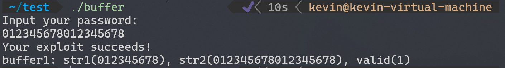

# Homework4

## T1

NOP sled是一串NOP指令，执行时不产生任何效果，这样跳到任何一个NOP都可以最后执行到malicious code

某些操作系统以及处理器会开启地址虚拟化，所以很难确定注入的malicious code的准确地址。不过可以知道大概的地址范围，所以可以通过在之前添加一些NOP指令，然后在NOP指令之后添加malicious code。当return指令执行时，会跳转到一个范围以内的地址，若在NOP之内则会一直执行NOP直到最后运行到malicious code。

## T2
1. 权限操作：如给攻击者提高权限，使其可以访问系统的重要文件。或者降低其余用户的权限等等。
2. 窃取数据：因为可以利用一个shell且可能拥有较高的权限，攻击者可以通过shell中的命令以及脚本等方式窃取数据，发送至攻击者。
3. 文件系统操作：攻击者可以删除，移动，复制文件等等。破坏文件系统的完整性。
4. 网络操作：攻击者可以通过Polymorphic Netcat等工具建立网络连接，进行端口扫描、文件传输和远程shell访问等。也可以进行其余的网络操作，如利用compromised的机器进行Dos攻击等等。
5. 改变系统配置：攻击者可以改变系统的配置，如修改系统环境变量，改变启动项，修改防火墙策略等等。


## T3

### a
在程序中str1和str2地址连续，str1处在str2。gets并不做边界检查，所以当输入的字符串长度超过str1的长度时，会覆盖str2的内容。攻击如下:



### b
在现在的gcc中默认开启堆栈保护，正常情况下编译出的可执行文件若使用了栈溢出攻击则会被系统检测到并终止程序。所以需要关闭堆栈保护，可以通过编译时加上`-fno-stack-protector`参数来关闭堆栈保护。

另外也可以通过限制输入的长度来防止栈溢出攻击，比如用fgets限定输入的长度。

## T4
| register| value |
|-----|--------|
| ecx | 0x3000 |
| edx | 0x899c |
| eip | 0x4000 |

| address | value|
|-----|--------|
| 0x9000 | 0x3333 |
| 0x9004 | 0x5000 |
| 0x9008 | 0x4000 |
| 0x900c | 0x6666 |
| 0x9010 | 0x6000 |

首先在0x4000取出值0x3333至eax,然后跳至0x3000之后跳至0x5000将0x333从eax放至ebx，之后跳至0x3000，然后跳至0x4000将0x6666取至eax，最后跳至0x6000将0x3333存入0x6666。
其中0x3000用于分支，0x4000用于取值，0x5000用于移动寄存器，0x6000用于存值。

## T5

uint32_t是无符号int型，所以在代码片段：
```c
if (8192 - (nlen+1) <= vlen ){ /* DANGER */ 
    vlen = 8192 - (nlen+1); 
}
```
若将hdr->vlen设为-1(在unsigned中是最大的值0xffff),hdr->nlen设为8192。则最后的值最后vlen将被置为0xffff,那么memcpy将会拷贝0xffff个字节，这将导致堆栈溢出。

## T6 Ostia: A Delegating Architecture for Secure System Call Interposition

#### Background
目前沙盒提供的受限执行环境方法大多是限制应用程序对敏感系统资源的访问，但是更加彻底的方法应当是基于系统调用拦截的方法。

#### Contribution
- 本文提出了一种新的系统调用拦截方法，Ostia。Ostia基于一种新的委派（Delegating）架构，克服了现有架构的限制
- 本文对现有沙箱的架构进行了分析，并对安全性 兼容性、灵活性、可部署性和性能等方面的影响因素进行了研究

#### 沙盒设计分类
- 纯用户级：使用软件隔离技术，在用户级强制执行策略，无需修改内核即可进行，但也存在一些问题：
  - 技术自身限制：一些语言和低级软件隔离技术对特定API或ABI规则非常具体，限制了应用程序的使用范围
  - 复杂度和可信度：对比硬件隔离机制，软件隔离机制的复杂度较高并且提供的安全保证更少，这也导致了其可信度较低
  - 开销问题：软件隔离机制为程序执行带来额外的开销，可能导致执行速度明显变慢
- 纯操作系统级：完全依赖硬件内存的保护，通过操作系统内核来实现隔离，速度快，但是这种方法也存在一些问题：
  - 内核外部接口的复杂性对沙盒隔离的正确性提出了挑战
  - 内核内部的复杂性加剧了可移植性、审计和代码维护的问题
- 混合沙箱系统：一部分代码位于内核级，利用操作系统的隔离机制，并提供基本的执行机制，其余部分位于用户级。与纯用户级解决方案相比，利用操作系统内核提供的硬件内存保护可以获得更高的保证、更好的兼容性

#### 混合沙箱系统研究——基于过滤器的系统
之前的混合沙箱系统主要是由Janus等人设计的基于过滤器的系统，其主要结构是：
1. 内核级别的跟踪机制，用于过滤沙盒应用程序的系统调用
2. 用户级别的监视器，根据用户指定的策略告诉跟踪接口哪些调用应该被允许或拒绝
当沙盒进程进行敏感调用时，跟踪机制将进程置于休眠状态并向监视器发送请求，监视器根据策略回复请求后，跟踪机制再继续执行。

上述架构与纯粹的用户级解决方案相比，利用操作系统内核提供的硬件内存保护可以产生更大的保证、更好的兼容性等，同时也将大部分沙箱保留在用户级提供安全的可扩展性、简化开发和维护等，是之前的一种比较好的解决方案。但是仍然存在一些由架构本身决定的、无法避免的问题——竞争条件（race conditions），以下对其进行介绍：
- 当进程中的线程共享单个文件描述符表时，描述符编号引用的对象在检查和使用之间可以发生变化。同样，如果两个线程共享当前工作目录，那么在检查和使用之间，第二个线程可以更改线程的当前工作目录。在过滤沙盒中似乎没有任何简单的方法来解决这些竞态条件。
- 共享内存（线程间和进程间）会导致参数竞态条件，即参数在策略引擎检查之后但在系统调用使用之前可能发生变化的竞态条件
- 文件系统中的全局共享状态产生的竞态条件。这些竞态条件分为两类：符号链接竞态条件和相对路径竞态条件.符号链接竞态条件是由于路径中的任何组件在检查和使用之间可能被符号链接替换而引起的;相对路径竞态条件是文件系统竞态条件的第二种类型，当进程的当前工作目录的父目录发生变化并且正在使用相对路径时会发生.

对于以上的问题，过滤式沙盒可以将将更多沙箱功能推入内核以及不支持特别有问题的程序类别（例如多线程应用程序）来缓解竞争问题。但是这也将导致混合沙箱的优势减少。基于此，作者提出了委派式的沙箱架构。

#### 委派式沙箱架构
委派式沙箱架构的基本思路是沙箱应用程序不再直接从内核请求敏感资源，而是将获取敏感资源的责任委托给控制沙箱的程序（“代理”）。该代理根据用户指定的安全策略代表沙盒程序访问资源，其结构由三部分组成：
1. 内核模块：执行硬编码策略，阻止所有直接访问敏感资源（例如open、socket）的调用，并提供了一个跳板机制，将委托的调用重定向回仿真库
2. 仿真库（Emulation library）：使用内核模块中的回调机制来重定向系统调用。当敏感的系统调用到达内核入口点时，仿真库将系统调用转换为对代理（Agent）的请求。为了加速代码中相同位置的后续系统调用，处理程序还会检查调用所在的机器指令，并且如果指令符合预期的形式，则在原地修补指令，直接跳转到处理程序，避免了通过内核的多次往返
3. 代理（Agent）:代理（Agents）是负责读取策略文件、启动初始沙盒进程、进行策略决策等任务的组件。每个沙盒进程都有自己的代理。代理向其沙盒进程提供的最重要功能是处理对仿真库的调用请求。系统调用可以分为三类：必须委派的调用、总是允许的调用和完全禁止的调用

考虑一次客户端的敏感系统调用，其过程如下：
1. 调用被重定向到仿真库
2. 仿真库将系统调用转换为对代理的请求
3. 代理根据策略文件决定是否允许该调用

这样的架构可以有效解决过滤式沙盒中的竞争条件问题，理由如下：
1. 线程间和进程间共享状态竞态条件： 在委派式沙盒中，敏感的系统调用由代理执行，因此敏感系统调用使用的文件描述符空间、当前工作目录等状态被代理独占。大多数竞态条件，如参数竞态条件，不再是一个问题，因为外部进程无法修改这些状态
2. 全局共享状态：从某种意义上说，过滤式沙盒面临的主要问题是它们无法控制程序如何访问资源。在委托式沙盒中，我们可以解决这个问题，因为沙盒自己执行对资源的所有访问。因此，访问可以按照尊重操作系统提供的在文件系统上提供无竞态操作的约定的方式进行。另一种观点是，代理是一个主动的代理，它规范调用操作系统，使其以可预测的结果形式提供

#### 二者对比
作者将janus version2 和Ostia做了对比，结论如下：
- 复杂性：考虑用户级代码。
  - Ostia代理总共有3,200行代码。其中，策略引擎占700行，其余的2,500行是系统核心代码。J2监视器实际上有3,000行代码（策略引擎占1,400行，核心代码占1,600行，还有额外的1,000行用于策略调试中的系统调用的日志打印）。因此，这两个系统的用户级部分大小几乎没有差异，也与最初的Janus原型相差不大，Janus原型只有不到3,000行代码。Ostia仿真库额外有1,000行代码，但它不是受信任计算基（TCB）的一部分，因为它运行在不受信任应用程序的地址空间中。
  - J2内核模块mod janus由1,400行C代码和11行x86汇编代码组成。Ostia内核模块mod ostia只有200行C代码和5行x86汇编代码。J2和Ostia内核部分的复杂性差异指出了每个工具对系统安全性的影响存在显著差异。内核bug可能使整个系统变得容易受到攻击，而用户空间部分的bug通常只会使沙盒失效。
- 可扩展性：
  - 委托架构为轻松支持新政策提供了扩展的潜力。 更具体地说，因为 Ostia 在用户级别处理授予对资源的访问权限，所以改变系统调用的实现本质上更容易。 这种增加的灵活性可以在各种场景中带来好处。
  - 过滤沙箱为更改调用实现提供了一些支持。 例如，有些支持重写参数、更改调用的返回值或在执行系统调用时更改进程的特权级别的能力，然而，对于调用执行方式的每一次新更改，都必须逐步向内核添加新的支持。委托沙箱很容易在用户级别完全容纳所有这些功能，因为Agent完全控制了调用的执行环境（例如调用参数、特权级别、描述符空间）
- 兼容性：出于实用性，应用程序沙箱必须与广泛的软件兼容。这要求不能重新编译或以其他方式修改应用程序来实现在沙箱中运行。 Ostia 以及许多过滤沙箱都符合这一标准。Ostia 还支持多线程应用程序。 由于竞争条件的问题，没有过滤沙箱系统支持多线程应用程序。
- 易部署性：程序的先决条件和依赖越少，就越容易部署到实际系统中
  - Ostia依赖于内核模块，这本身就造成了一些部署困难，因为它要求安装它的任何机器都有C编译器和适当的头文件，或者合适的预编译模块
  - Ostia的模块非常简单，对内核内部的依赖很少，这使得移植和维护变得容易
  - 许多过滤沙箱(包括J2)所需的内核模块更大、更复杂，对内核内部有重要的依赖，可能需要随着内核的发展而仔细更改，这使得移植和维护变得更加困难
- 性能开销：
  - 相较于无沙盒执行geteuid指令，J2运行时间为9倍，Ostia运行时间为12倍。相较于无沙盒执行open指令，J2运行时间为5倍，Ostia运行时间为8倍。作者将执行open的过程分解，发现 Ostia 的策略引擎比 J2 的慢。 这是因为 Ostia 的策略引擎经常进行多个系统调用，而用于文件系统操作的 J2 策略引擎主要是字符串匹配操作。 该表还显示 Ostia 具有更高的“额外”内核开销，这可能是由于进程间文件描述符的传递造成。
  - 在web serving，decompress, encode, build四个过程，J2与Ostia的运行时间相差无几
  - 打开和关闭 1,000,000 个文件的时间。 “No.Procs”是文件操作在每一行中被划分的进程数,当该数值为1时，Ostia运行时间为J2的1.5倍;当该数值为25时，Ostia运行时间为J2的1.1倍;当该数值为50时，Ostia运行时间为J2的0.6倍;当该数值为001时，Ostia运行时间为J2的0.08倍

#### 总结
本文在现有沙箱架构的基础上提出了一种新的委派式沙箱架构，Ostia。Ostia通过将获取敏感资源的责任委托给控制沙箱的程序，解决了过滤式沙箱中的竞争条件问题。Ostia的提出为沙箱技术的发展提供了新的思路，对于提高沙箱技术的安全性、兼容性、易部署性和性能开销等方面具有重要意义。

## Contribution
- 宋林恺 T1-5
- 罗胤玻 T6